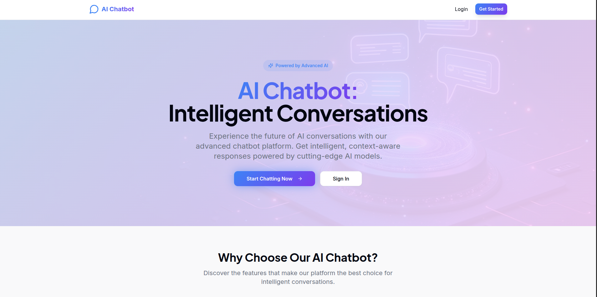
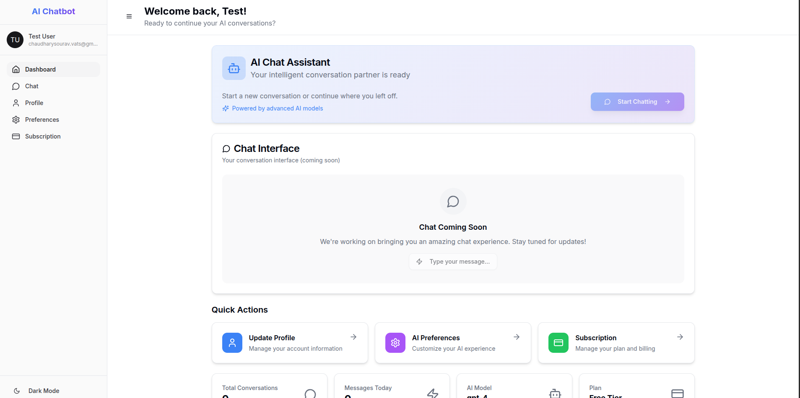
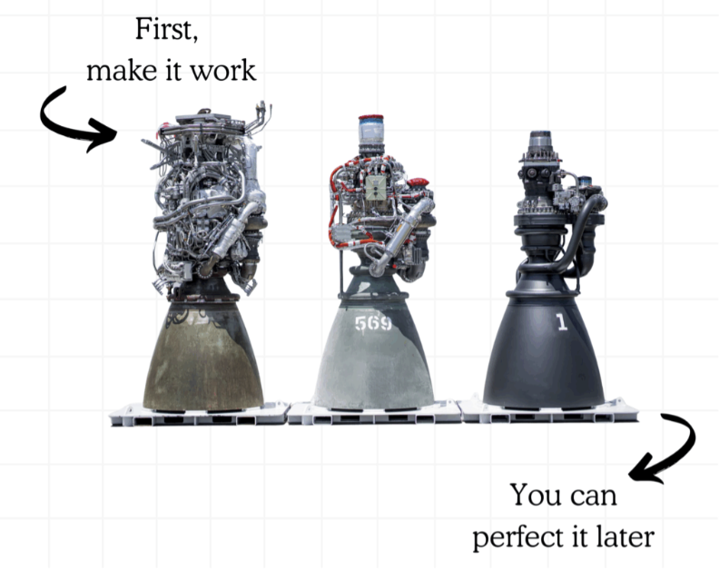

# AI Chatbot Microservices

A production-grade distributed AI chatbot system currently in active development, showcasing modern microservices architecture with real-time streaming responses, comprehensive observability, and scalable infrastructure design.

## Project Status

**Currently in Development - Backend Services Phase**

This project is actively being built to demonstrate enterprise-level software engineering practices through a complete chat application. The backend microservices are currently under development, with core services and infrastructure being implemented.

**Development Progress:**
- Core microservices architecture design completed
- User Service: Authentication and profile management implemented
- Chat Service: Conversation and message management implemented  
- AI Service: gRPC integration with Ollama in progress
- API Gateway: WebSocket and service orchestration in development
- Database schemas and migrations established
- Docker containerization and local development environment configured

## Architecture Overview

The system follows a microservices architecture with clear service boundaries and responsibilities, designed for production scalability and maintainability.

**API Gateway** serves as the entry point, handling authentication, rate limiting, and WebSocket connections for real-time communication. It orchestrates requests across downstream services and manages client sessions.

**User Service** manages authentication, user profiles, and preferences using JWT tokens and bcrypt password hashing. It provides user analytics and activity tracking with proper security measures including account lockout policies.

**Chat Service** handles conversation sessions and message persistence. It maintains chat history, manages typing indicators, and provides search capabilities across conversations with full-text indexing.

**AI Service** integrates with Ollama for AI response generation, supporting multiple models and streaming responses. It processes conversation context and generates intelligent replies with configurable parameters like temperature and token limits.

## Technology Stack

**Backend Services (In Development):**
- API Gateway: Node.js with TypeScript, Express, Socket.IO for WebSocket support
- User Service: Go with gRPC, GORM for database operations, Redis for caching
- Chat Service: Go with gRPC, PostgreSQL for message storage, Redis for session management  
- AI Service: Python with FastAPI, gRPC server, Ollama integration for AI generation

**Data Layer:**
- PostgreSQL for persistent data storage (users, conversations, messages)
- Redis for caching, session management, and real-time features
- Elasticsearch for advanced search capabilities and log aggregation (planned)

**Communication Protocols:**
- gRPC for internal service communication with Protocol Buffers
- WebSocket for real-time client communication  
- REST APIs for external integrations and debugging

**Infrastructure & DevOps:**
- Docker for containerization with multi-stage builds
- Docker Compose for local development environment
- Kubernetes-ready architecture with health checks and monitoring endpoints
- Prometheus and Grafana for metrics and monitoring (planned)

## Planned Features

**Real-time Communication:**
WebSocket-based instant message delivery with typing indicators, streaming AI responses, and seamless real-time interactions without polling overhead.

**Advanced AI Integration:**
Multiple AI model support through Ollama, with configurable personas (assistant, creative, analytical, professional). Streaming responses for better user experience and conversation context maintenance across multiple turns.

**Production-Ready Architecture:**
Comprehensive health checks, structured logging, graceful shutdown handling, and robust error management. Rate limiting, request validation, and security best practices throughout.

**Scalability & Performance:**
Independent service scaling, connection pooling, intelligent caching strategies, and asynchronous processing. Horizontal scaling support and load balancing across service instances.

**Security & Compliance:**
JWT-based authentication with refresh tokens, bcrypt password hashing, comprehensive input validation, CORS policies, and multi-layer rate limiting protection.

## Development Approach

**Microservices Design Principles:**
Each service maintains clear boundaries with single responsibilities, communicates through well-defined APIs, and can be developed, deployed, and scaled independently.

**Production Engineering Focus:**
The development process emphasizes production-readiness from the start, including proper error handling, monitoring capabilities, security considerations, and performance optimization.

**Modern Development Practices:**
Implementation follows current industry standards with comprehensive testing strategies, code quality tools, API documentation, database migrations, and CI/CD pipeline preparation.

## Project Structure

The project is organized with clear separation between services and shared components:

- **services/api-gateway**: Node.js/TypeScript gateway service handling routing and WebSocket management
- **services/user-service**: Go-based user management with authentication and profiles
- **services/chat-service**: Go-based conversation management with message persistence
- **services/ai-service**: Python-based AI integration with Ollama and gRPC streaming
- **proto**: Shared protobuf definitions for service communication contracts
- **infrastructure**: Docker configurations and deployment specifications
- **scripts**: Development automation and deployment utilities

## Technical Implementation Highlights

**gRPC Communication Layer:**
All internal services communicate via gRPC for high performance, strong typing with Protocol Buffers, and built-in features like connection pooling, load balancing, and health checking.

**Real-time Streaming Architecture:**
The system implements a sophisticated streaming pipeline where AI responses flow from the AI service through gRPC streams to the API Gateway, which then broadcasts them to clients via WebSocket connections.

**Data Modeling:**
Comprehensive data models designed for scalability, with proper relationships, indexing strategies, and caching layers to support high-throughput conversational workloads.

**Security Implementation:**
Multi-layered security approach including JWT tokens with refresh mechanics, password policy enforcement, rate limiting at multiple levels, and input validation throughout the request pipeline.

## Monitoring and Observability (Planned)

**Health Monitoring:**
Each service exposes detailed health endpoints for Kubernetes liveness and readiness probes, with the API Gateway providing aggregated health status across all services.

**Structured Logging:**
Comprehensive logging with correlation IDs for request tracing across service boundaries, including user context, performance metrics, and detailed error information for debugging.

**Metrics and Alerting:**
Services will expose Prometheus metrics including request rates, response times, error rates, and business metrics like active conversations and AI generation latency.

## Future Enhancements

The project roadmap includes advanced features that will be implemented in subsequent development phases:

- Frontend application with React/Next.js
- Advanced RAG (Retrieval-Augmented Generation) capabilities with vector databases
- Event-driven architecture with RabbitMQ for asynchronous processing
- Elasticsearch integration for advanced search and analytics
- Comprehensive monitoring with Grafana dashboards and alerting
- Kubernetes deployment configurations for production scaling
- CI/CD pipelines with automated testing and deployment

## Development Philosophy

This project serves as a comprehensive demonstration of modern software engineering practices, emphasizing clean architecture, proper testing methodologies, production readiness, and scalable design patterns. The development process prioritizes code quality, maintainability, and real-world applicability.

The implementation showcases expertise in distributed systems, microservices architecture, real-time communication, AI integration, and DevOps practices, making it a valuable reference for production-grade software development.

## Current Focus

The immediate development focus is completing the backend microservices foundation, establishing robust service communication, implementing comprehensive error handling, and ensuring the core chat and AI integration functionality works reliably in a distributed environment.

This foundation will support the subsequent phases of frontend development, advanced AI features, and production deployment capabilities.

